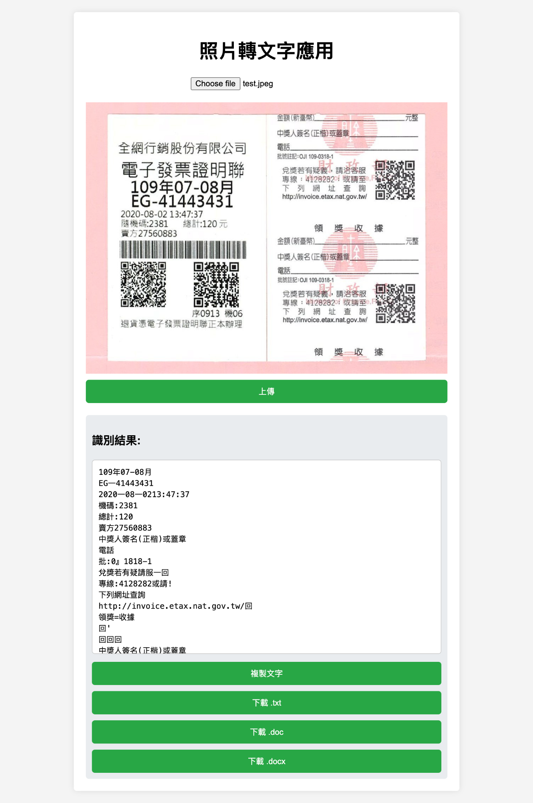

# 📷 照片轉文字 OCR 網頁應用

這是一個簡單的 Web 專案，使用 Python Flask 建立後端，前端為 HTML + JS + CSS，可上傳圖片並透過 [OCR.Space API](https://ocr.space/OCRAPI) 進行文字辨識，支援繁體中文。



---

## 🔧 專案功能特色

- ✅ 上傳圖片（JPG / PNG）
- ✅ 預覽上傳圖片
- ✅ 使用 [OCR.Space API](https://ocr.space/OCRAPI) 辨識繁體中文文字
- ✅ 顯示辨識結果
- ✅ 支援文字複製
- ✅ 支援下載辨識結果為 `.txt` / `.pdf` / `.doc` / `.docx`

---

## 🧰 使用技術與工具

### 📌 前端
- HTML5 / CSS3 / JavaScript
- jsPDF（支援 PDF 輸出與繁體字型）
- Base64 字型內嵌：`NotoSansTC-Regular`（支援中文）

### 🧪 後端
- Python 3.x
- Flask：輕量級 Web 框架
- Requests：向 OCR.Space 發送 POST API 請求

### 🌐 API
- OCR.Space OCR API：將圖片轉成文字  
  https://ocr.space/OCRAPI

---

## 📦 安裝與執行

### ✅ 安裝必要套件
```bash
pip install -r requirements.txt
```

### ✅ 本機執行 Flask 伺服器
```bash
python app.py
```

然後開啟瀏覽器輸入：
```
http://localhost:5000
```

---

## ☁️ Render 雲端部署

### 1️⃣ 專案結構包含 `render.yaml`，自動部署設定如下：

```yaml
services:
  - type: web
    name: invoice-ocr
    env: python
    plan: free
    buildCommand: ""
    startCommand: "python app.py"
```

### 2️⃣ 推上 GitHub 並連結 Render：
- [https://invoice-6wzx.onrender.com/](https://invoice-6wzx.onrender.com/)
- 建立 Web Service → 選擇 GitHub Repo → 部署完成即提供網址

---

## 📁 專案結構

```
invoice-ocr/
├── app.py                # Flask 應用主程式
├── index.html            # 前端網頁
├── script.js             # 前端邏輯處理
├── style.css             # 樣式設計
├── requirements.txt      # Python 套件需求
├── render.yaml           # Render 雲端部署設定
├── screenshot.png        # 專案畫面截圖
```

---

## 📜 授權與出處

- OCR 技術由 [OCR.Space](https://ocr.space/) 提供免費 API
- 繁體字體使用 Google 提供的 [Noto Sans TC](https://fonts.google.com/specimen/Noto+Sans+TC)

---

## 🙋‍♀️ 開發者

Song

> 歡迎改作、擴充功能（支援多語、Tesseract 本地引擎、帳號系統等）！
